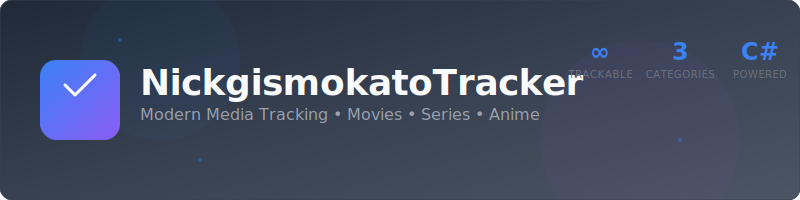

<p align="center">
  
</p>
# NickgismokatoTracker

<p align="center">
  
  
  
  
</p>

**A sleek, modern desktop application for tracking your movies, series, and anime viewing progress.**

## ✨ Features

### 📊 **Organized Tracking**
- **Planning To Watch** - Keep a wishlist of media you want to watch
- **Watching** - Track your current viewing progress with season/episode numbers
- **Completed** - Archive your finished content with completion dates

### 🎬 **Multi-Media Support**
- **Movies** - Track films with release dates
- **TV Series** - Monitor seasons and episodes
- **Anime** - Follow your anime journey with detailed progress

### 🎨 **Modern Interface**
- Clean, dark-themed UI inspired by Windows Snipping Tool
- Intuitive tabbed navigation
- Responsive data grids with real-time updates
- Edit-in-place functionality for quick updates

### 💾 **Smart Data Management**
- Automatic JSON serialization/deserialization
- Local data storage in Windows AppData folder
- Robust error handling and logging system
- Async operations for smooth performance

## 🚀 Quick Start

### Prerequisites
- Windows 10/11
- .NET 8.0 Runtime

### Installation
1. Clone the repository:
   ```bash
   git clone https://github.com/nickgismokato/NickgismokatoTracker.git
   ```
2. Open `NickgismokatoTracker.sln` in Visual Studio 2022
3. Restore NuGet packages (ModernWpfUI)
4. Build and run the application

## 🏗️ Architecture

### **Data Model**
```
MediaItem (Abstract Base)
├── MovieItem
├── SeriesItem (Season, Episode)
└── AnimeItem (Season, Episode)
```

### **Core Components**
- **DataManager** - Handles all data operations and persistence
- **Logger** - Comprehensive logging with multiple levels (INFO, DEBUG, WARN, ERROR)
- **PathHelper** - Manages application data folder paths
- **JSON Converter** - Custom polymorphic serialization for MediaItem types

### **Data Storage**
- **Format**: JSON
- **Location**: `%LocalAppData%/NickgismokatoTracker/`
- **Files**: 
  - `NickgismokatoTracker.json` (data)
  - `NickgismokatoTracker.log` (application logs)

## 🎯 Usage

### Adding New Media
1. Navigate to the **Add** tab
2. Enter title and select media type (Movie/Series/Anime)
3. For Series/Anime: Add season and episode information
4. Choose the appropriate category
5. Click **Add** to save

### Managing Your Lists
- **View Tab**: Browse your categorized media lists
- **In-place Editing**: Click any cell to edit details
- **Category Transfer**: Move items between Planning/Watching/Completed
- **Progress Tracking**: Update season/episode progress for ongoing series

## 🔧 Technical Details

### **Built With**
- **Framework**: .NET 8.0 with WPF
- **UI Library**: ModernWpfUI for modern Windows theming
- **Data Format**: JSON with custom converters
- **Architecture**: MVVM-inspired with clean separation

### **Key Features**
- **Async Data Operations** - Non-blocking file I/O
- **Error Resilience** - Comprehensive exception handling
- **Type Safety** - Strong typing with nullable reference types
- **Logging** - Detailed application logging for debugging

## 📁 Project Structure

```
NickgismokatoTracker/
├── Backend/
│   ├── Data/
│   │   ├── Item/           # MediaItem classes
│   │   ├── DataManager.cs  # Data persistence layer
│   │   └── TrackerData.cs  # Data container
│   └── Util/
│       ├── Logging/        # Logger implementation
│       └── PathHelper.cs   # Path utilities
├── Frontend/
│   └── UI/
│       ├── MainWindow.xaml    # Main application window
│       └── MainWindow.xaml.cs # UI logic
└── App.xaml/App.xaml.cs      # Application entry point
```

## 🤝 Contributing

Contributions are welcome! Feel free to:
- Report bugs or suggest features via Issues
- Submit pull requests for improvements
- Share feedback on the user experience

## 📝 License

This project is open source and available under the [MIT License](LICENSE).

## 👨‍💻 About the Developer

Created by [Nickgismokato](https://github.com/nickgismokato) - A passionate full-stack developer specializing in C# and Python applications.

**Other Projects:**
- [Satyr-Scheduler](https://github.com/nickgismokato/Satyr-Scheduler) - Automatic scheduling tool
- [ReunionLog](https://github.com/nickgismokato/ReunionLog) - WarcraftLogs data extraction

---

<p align="center">
  <strong>Happy Tracking! 🎬📺🎌</strong>
</p>